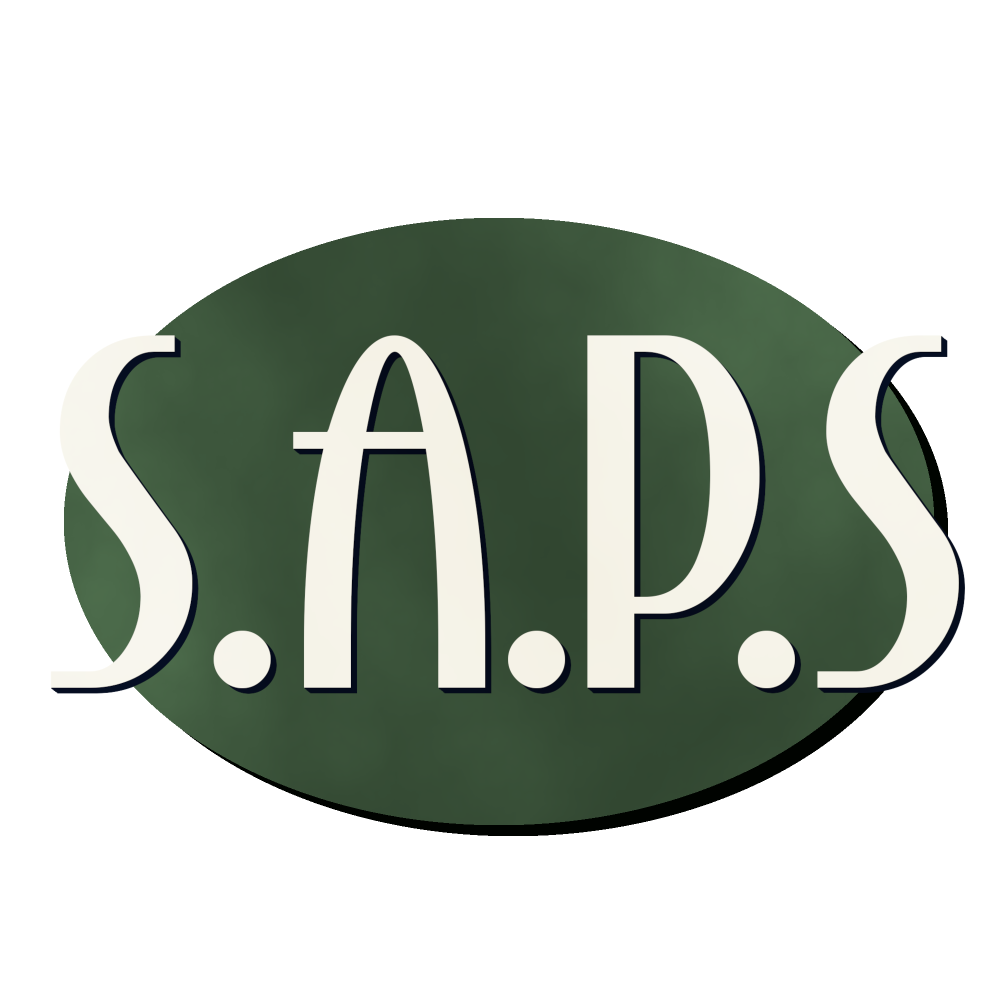

  

<h1 align="center">Sapp's Asset & Personnel Suppression</h1>

  
  
  
  
  

## Overview
S.A.P.S. (Sapp's Asset & Personnel Suppression) is a fictional organisation central to our project. Although it projects a professional corporate image, beneath that lies an intricate network of assassination contracts, in-game simulations, and covert operations.

This repository contains the active development of the S.A.P.S. simulation. The project began in February 2025 and is being developed in a studio-style environment. It is designed to be both a functional game and a polished portfolio piece.

## Development Team
The simulation is developed by a small, dedicated team of student creators:

- Christian  
- Jenna  
- Josh  
- Rohan  
- Mike  
- Amber  

We’ve been actively building since February 2025, with contributions spanning gameplay programming, narrative, NPC AI, and contract implementation.

## Company Backstory
S.A.P.S. was founded by **Andrew Sapp**, whose vision was to merge simulation training with clandestine assassination service.

Publicly presented as a law firm, the organisation conceals its true nature by:

- Recruiting operatives into a VR-based onboarding experience.  
- Issuing assassination contracts under the guise of corporate deals.  
- Instructing all staff to deny any connection with S.A.P.S. when questioned.

This duality frames both the narrative and gameplay, balancing satire with immersive world-building.

## Player Experience
Players take on the role of newly-hired agents within S.A.P.S. After undergoing the satirical onboarding, recruits are issued simulated contracts that feel like legitimate corporate assignments.

Key elements include:

- **Recruitment & Training** — A VR onboarding sequence that introduces players to the organisation’s philosophy and rules.  
- **Dynamic Contracts** — Missions with unique conditions, NPC reactions, and branching possibilities.  
- **Corporate Facade** — Players must maintain the illusion of a law firm when confronted by outsiders, infusing tension and dark humor.

## Core Features
The project currently focuses on:

- **NPC Behaviour Systems** — Complex reactions to player actions, suspicion mechanics, and emergent narrative moments.  
- **Contract Engine** — A modular system to generate diverse assassination assignments.  
- **Onboarding Script** — A humorous yet unsettling introduction to S.A.P.S.’ true nature.  
- **Lore Extensions** — In-universe media like the “infotainment onboarding programme” and an exposé documentary build the game’s broader narrative.

## Development Roadmap
Our progress is structured across iterative sprints. We track tasks, milestones, and feature backlog items via our roadmap and project board.

- **Active Sprints** focus on NPC logic, contract mechanics, UI integration, and playtesting.  
- **Past Sprints** included environment setup, early AI prototypes, and narrative experimentation.  
- **Upcoming Sprints** will develop advanced NPC interactions, contract diversity, and polish.

For detailed tracking:
- [Project Board Link](https://github.com/orgs/OtagoPolytechnic/projects/36)  
- [Roadmap Document](https://github.com/OtagoPolytechnic/S.A.P.S/wiki/Road-Map)

## Purpose of this Repository
This repository serves as both a collaborative development platform and a polished introduction for external viewers—especially potential employers, collaborators, or reviewers of the design and technical work behind S.A.P.S.

---

